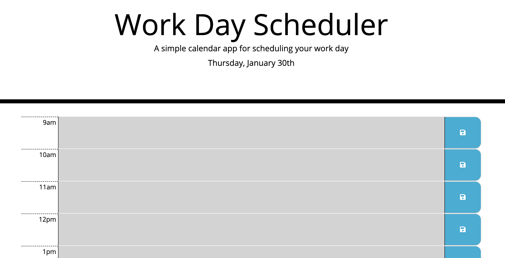

# cautious-planner

cautious-planner is a day planner that shows every business hour(9am through 5pm), color codes each hour depending on whether it is in the past, present or future, and has a text box for each hour that saves locally.

### [link to project](https://deloabra.github.io/cautcious-planner/)

